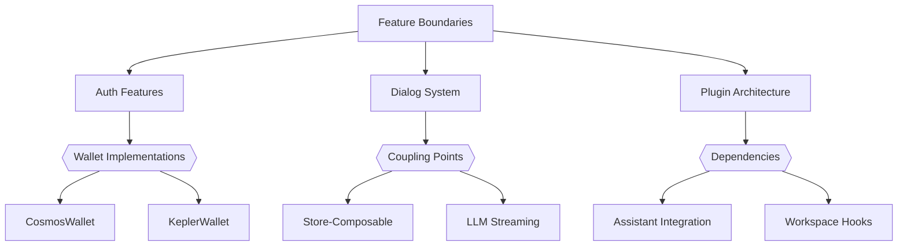
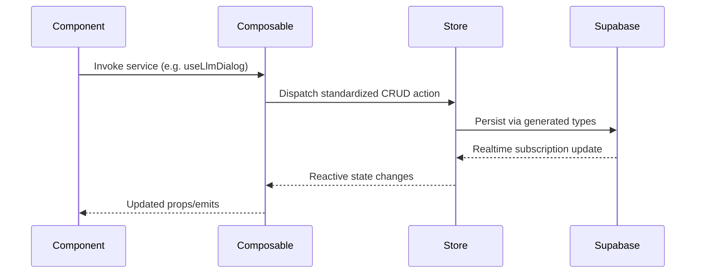
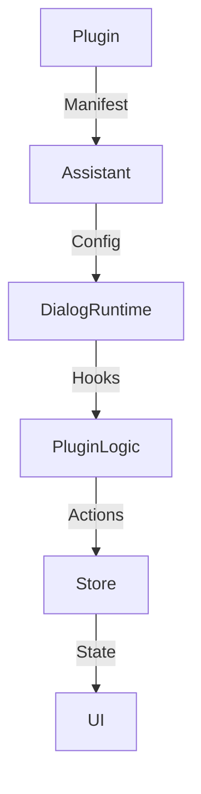

# AIaW System Patterns

## Architectural Foundation



- **Feature-Based Modular Architecture**
  - Self-contained feature modules with:
    - Dedicated components
    - Composables for business logic
    - Pinia stores for state management
  - Clear module boundaries via dependency injection

## Key Data Flows
1. **Dialog Creation Flow**
   ```mermaid
   sequenceDiagram
     UI->>+DialogsStore: createDialog()
     DialogsStore->>+UserDataStore: get defaultAssistantIds
     UserDataStore-->>-DialogsStore: assistant IDs
     DialogsStore->>+DialogMessagesStore: createInitialMessage()
     DialogMessagesStore-->>-DialogsStore: message created
     DialogsStore-->>-UI: dialog with initial message
   ```

2. **State Persistence Flow**
   ```mermaid
   flowchart LR
     StoreState --> Memory[(Memory)]
     StoreState -->|Throttled| Supabase[(Supabase)]
     Supabase -->|Realtime| StoreState
   ```

## State Management Patterns
- **Store Relationships**
  ```mermaid
  graph TD
    UserStore --> FeatureStores
    KeyValueDbStore --> UserDataStore
    DialogsStore --> DialogMessagesStore
    WorkspacesStore --> DialogsStore
  ```

- **Store Initialization**
  - Auth state drives store hydration
  - Feature stores initialize after user authentication
  - Database subscriptions maintain real-time sync

## Cross-Cutting Concerns

### Enhanced Pattern Documentation

**Pattern 1: Composable Service Architecture**


**Pattern 2: Type-Safe Operations**
- Three-layer type validation:
  1. Database Types (DbDialogMessageUpdate)
  2. Business Logic Types (DialogMessageNested)
  3. UI Presentation Types
- Generics enforce consistency:
  ```ts
  function upsert<T extends EntityBase>(entity: T) {
    // Type-guarded operations
  }
  ```

**Pattern 3: Plugin Integration Flow**


3. **Artifact Versioning**
   - Content edits → Version snapshots → Supabase history
