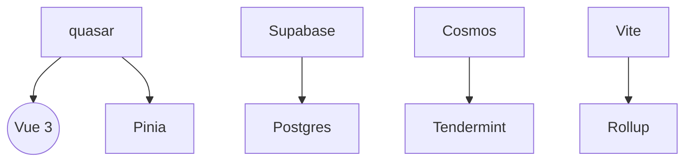
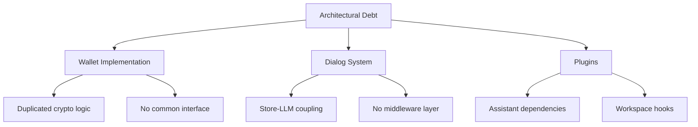
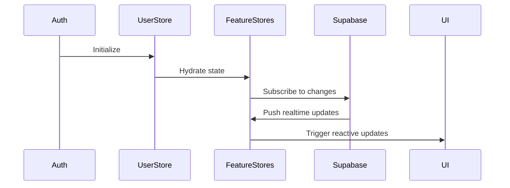

# Technology Context

## Core Stack
| Category        | Technologies              |
|-----------------|---------------------------|
| UI Framework    | Vue 3 + Quasar            |
| State Management| Pinia                     |
| Security        | WebCrypto + AES-GCM       |
| Storage         | IndexedDB + Supabase      |
| Blockchain      | Cosmos SDK                |
| Testing         | Jest + Testing Library    |
| Build           | Vite 4+                   |

## Key Dependencies


## Development Practices
- Atomic component design
- Composable-driven architecture
- End-to-end encryption by default
- Automated type generation (scripts/generate-types.js)

## Architectural Debt


## Store Hydration Pattern


**Key Debt Items:**
- **Wallet Implementation Duplication**
  - Cosmos vs Kepler wallets share 73% similar code
  - No common interface for blockchain operations

- **Dialog System Coupling**
  - Store directly manages LLM stream connections
  - Message processing lacks middleware layer

- **Plugin Tight Coupling**
  - Assistant-specific hooks in plugin API
  - Workspace dependencies in plugin initialization

## Composable Services
- Standardized LLM interaction pattern:
  ```typescript
  export const useLlmDialog = (workspaceId, dialogId, assistant) => {
    // 1. Inject stores
    // 2. Configure LLM stream
    // 3. Expose standardized methods
  }
  ```
