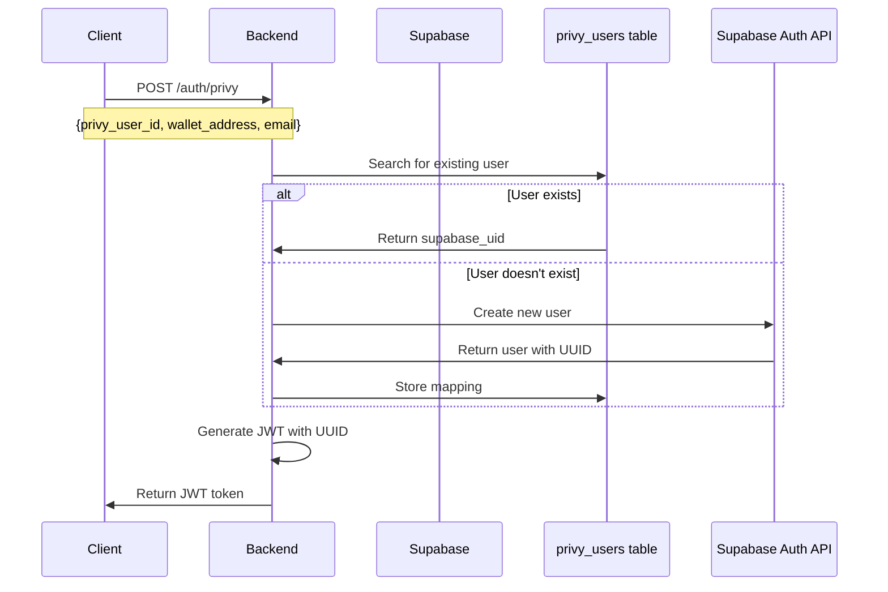
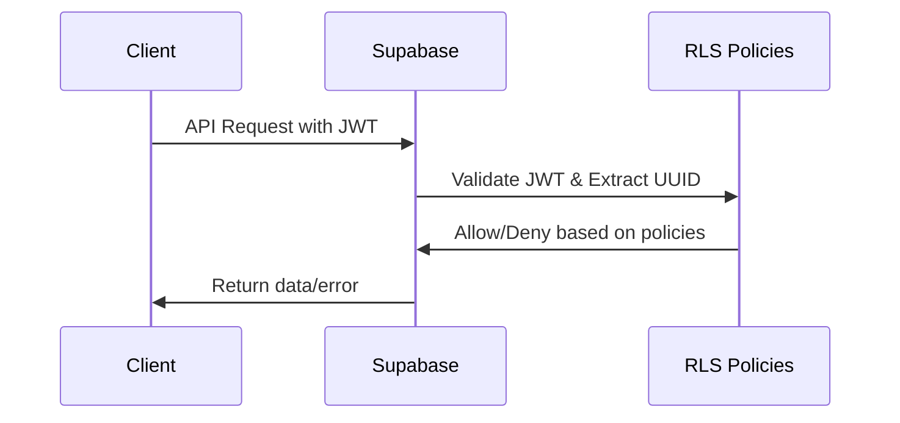

# Custom JWT Authentication for AIaW

## Overview

This document describes the custom JWT authentication system implemented in AIaW that bridges Privy (Web3 wallet authentication) with Supabase database. The system generates JWT tokens that are fully compatible with Supabase's Row Level Security (RLS) policies.

## Architecture

### Problem Statement
- **Privy** provides Web3 wallet authentication but uses DID format identifiers like `did:privy:...`
- **Supabase** requires JWT tokens with UUID in the `sub` field for RLS policies
- Need to bridge these two systems while maintaining security and compatibility

### Solution
1. **User Mapping Table**: `privy_users` table stores the relationship between Privy DID and Supabase UUID
2. **Custom JWT Generator**: Backend generates Supabase-compatible JWT tokens
3. **Automatic User Creation**: New users are automatically created in Supabase Auth when they first authenticate through Privy

## Database Schema

### `privy_users` Table
```sql
CREATE TABLE "public"."privy_users" (
    "id" uuid DEFAULT gen_random_uuid() NOT NULL,
    "supabase_uid" uuid NOT NULL,
    "privy_user_id" text NOT NULL,
    "wallet_address" text,
    "email" text,
    "created_at" timestamp with time zone DEFAULT now(),
    "updated_at" timestamp with time zone DEFAULT now(),

    CONSTRAINT "privy_users_pkey" PRIMARY KEY ("id"),
    CONSTRAINT "privy_users_supabase_uid_fkey" FOREIGN KEY ("supabase_uid") REFERENCES "auth"."users"("id") ON DELETE CASCADE,
    CONSTRAINT "privy_users_privy_user_id_key" UNIQUE ("privy_user_id")
);
```

## Authentication Flow

### 1. User Authentication Request


### 2. API Request with JWT


## Implementation Details

### Core Functions

#### `get_or_create_supabase_user(privy_user_id, wallet_address, email)`
```python
def get_or_create_supabase_user(privy_user_id: str, wallet_address: str = None, email: str = None) -> str:
    """
    Find or create a Supabase user by privy_user_id. Returns the UUID (as string).

    1. Search for existing user in privy_users table
    2. If not found, create new user via Supabase Auth API
    3. Store the mapping in privy_users table
    4. Return the Supabase UUID
    """
```

#### `generate_jwt_token_for_uuid(uuid, privy_user_id, wallet_address, email, metadata)`
```python
def generate_jwt_token_for_uuid(uuid: str, privy_user_id: str, ...) -> str:
    """
    Generate Supabase-compatible JWT token with:
    - sub: Supabase UUID (required for RLS)
    - aud: 'authenticated' (Supabase requirement)
    - role: 'authenticated' (Supabase requirement)
    - iss: 'aiaw-backend' (our issuer)
    - user_metadata: Privy user data
    """
```

## JWT Token Structure

### Standard Claims
```json
{
  "sub": "83a33b62-6383-4263-bc28-8485b6d6d493",  // Supabase UUID
  "aud": "authenticated",                          // Supabase audience
  "role": "authenticated",                         // Supabase role
  "iss": "aiaw-backend",                          // Our issuer
  "iat": 1751524217,                              // Issued at
  "exp": 1751527817                               // Expires at
}
```

### Custom Claims
```json
{
  "user_metadata": {
    "privy_user_id": "did:privy:cmc1lhine01gwl70m6f81zhsk:test-user-uuid",
    "wallet_address": "0x742d35Cc6635C0532925a3b8D82C5f1fC7C1e6b",
    "email": "testuser@chatcyber.ai"
  }
}
```

## API Endpoints

### `POST /auth/privy`
Authenticate user with Privy credentials and return JWT token.

**Request Body:**
```json
{
  "privy_user_id": "did:privy:cmc1lhine01gwl70m6f81zhsk:test-user-uuid",
  "wallet_address": "0x742d35Cc6635C0532925a3b8D82C5f1fC7C1e6b",
  "email": "testuser@chatcyber.ai",
  "metadata": {
    "additional": "data"
  }
}
```

**Response:**
```json
{
  "access_token": "eyJhbGciOiJIUzI1NiIsInR5cCI6IkpXVCJ9...",
  "token_type": "bearer",
  "expires_in": 3600
}
```

### `GET /auth/test`
Test endpoint to verify JWT token functionality.

**Response:**
```json
{
  "message": "JWT auth is working",
  "timestamp": "2025-01-03T06:30:17.123456"
}
```

## Environment Configuration

### Required Environment Variables

```bash
# JWT Configuration
JWT_SECRET=your-super-secret-jwt-token-with-at-least-32-characters
JWT_ALGORITHM=HS256
JWT_EXPIRY=3600  # 1 hour

# Supabase Configuration
SUPABASE_URL=http://localhost:8000  # or your Supabase URL
SERVICE_ROLE_KEY=your-service-role-key
```

### Docker Setup
```yaml
# docker-compose.yml
services:
  aiaw-backend:
    environment:
      - SUPABASE_URL=http://kong:8000
      - SERVICE_ROLE_KEY=${SERVICE_ROLE_KEY}
      - JWT_SECRET=${JWT_SECRET}
```

## Usage Examples

### 1. Authenticate User
```bash
# Generate JWT token
TOKEN=$(curl -s -X POST "http://localhost:8001/auth/privy" \
  -H "Content-Type: application/json" \
  -d '{
    "privy_user_id": "did:privy:cmc1lhine01gwl70m6f81zhsk:test-user-uuid",
    "wallet_address": "0x742d35Cc6635C0532925a3b8D82C5f1fC7C1e6b",
    "email": "testuser@chatcyber.ai"
  }' | jq -r '.access_token')

echo "Generated token: ${TOKEN:0:50}..."
```

### 2. Decode JWT Token
```bash
# Decode JWT payload
echo $TOKEN | cut -d'.' -f2 | sed 's/$/==/' | base64 -d | python3 -m json.tool
```

### 3. Use JWT with Supabase
```bash
# Make authenticated request to Supabase
curl -X GET "http://localhost:8000/rest/v1/profiles?select=id,name&limit=1" \
  -H "Authorization: Bearer $TOKEN" \
  -H "apikey: your-anon-key" \
  -H "Content-Type: application/json"
```

## Security Considerations

### 1. JWT Secret Management
- Use a strong, randomly generated secret (minimum 32 characters)
- Store in environment variables, never in code
- Rotate secrets regularly in production

### 2. Token Expiry
- Default expiry: 1 hour
- Adjust based on security requirements
- Implement token refresh mechanism if needed

### 3. CORS Configuration
- Whitelist only trusted origins
- Use specific patterns for subdomains
- Enable credentials for cross-origin requests

### 4. User Data Privacy
- Privy user data is stored in `user_metadata` claim
- Access is controlled by Supabase RLS policies
- Personal data is encrypted in transit and at rest

## Testing

### Manual Testing
```bash
# Test authentication flow
npm run test:auth

# Test JWT generation
curl -X GET "http://localhost:8001/auth/test"

# Test Supabase integration
curl -X GET "http://localhost:8000/rest/v1/profiles" \
  -H "Authorization: Bearer $TOKEN"
```

### Automated Testing
```python
# Example test case
def test_privy_auth():
    response = requests.post('/auth/privy', json={
        'privy_user_id': 'did:privy:test:user',
        'wallet_address': '0x123...',
        'email': 'test@example.com'
    })
    assert response.status_code == 200
    assert 'access_token' in response.json()
```

## Troubleshooting

### Common Issues

1. **JWT Token Invalid**
   - Check JWT_SECRET matches between backend and Supabase
   - Verify token hasn't expired
   - Ensure proper algorithm (HS256)

2. **User Creation Failed**
   - Check SERVICE_ROLE_KEY has admin privileges
   - Verify SUPABASE_URL is correct
   - Check network connectivity to Supabase

3. **RLS Policies Not Working**
   - Verify `sub` field contains UUID, not DID
   - Check policy conditions match JWT claims
   - Ensure policies are enabled

### Debug Mode
Enable debug logging in backend:
```python
import logging
logging.basicConfig(level=logging.DEBUG)
```

## Future Enhancements

1. **Token Refresh**: Implement refresh token mechanism
2. **Multi-Wallet Support**: Support multiple wallets per user
3. **Role-Based Access**: Implement custom roles beyond 'authenticated'
4. **Audit Logging**: Track authentication events
5. **Rate Limiting**: Prevent brute force attacks

## References

- [Supabase JWT Documentation](https://supabase.com/docs/guides/auth/jwt)
- [Privy Documentation](https://docs.privy.io/)
- [FastAPI Security](https://fastapi.tiangolo.com/tutorial/security/)
- [JWT.io](https://jwt.io/) - JWT debugger and documentation
